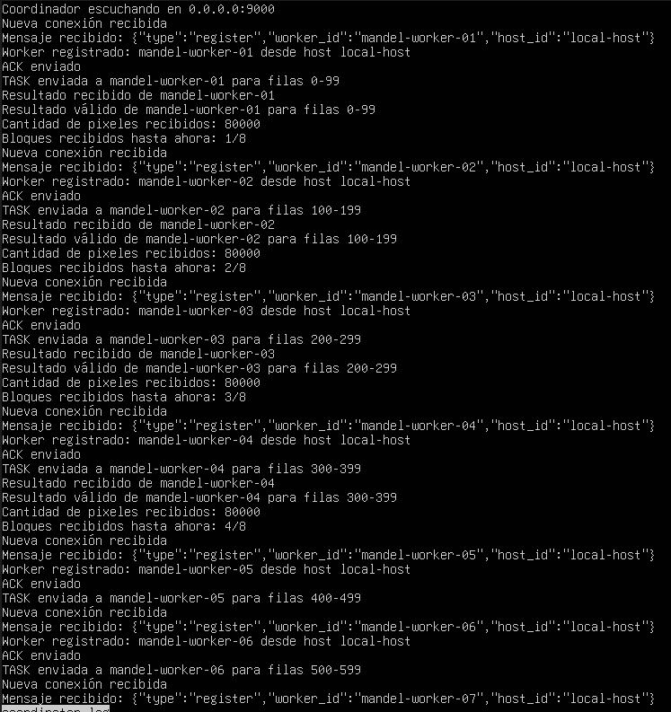
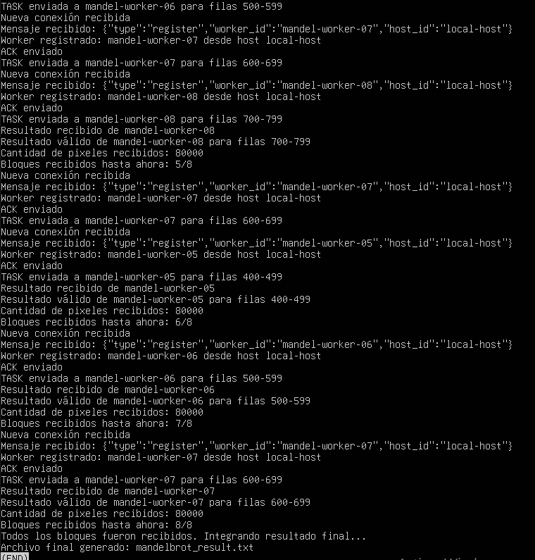
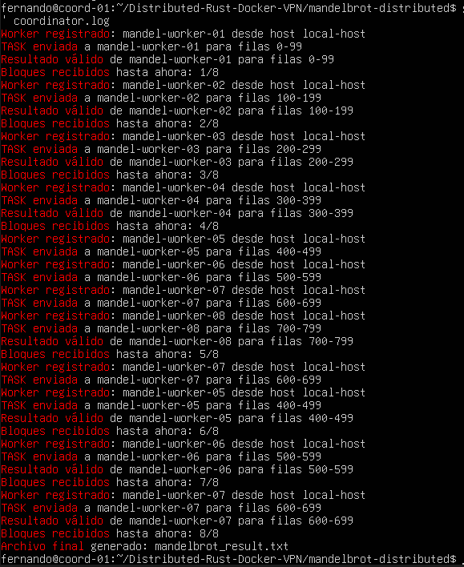
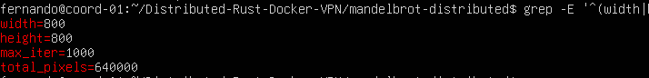

# Versión final funcional de Mandelbrot distribuido

## Objetivo

Implementar una versión final funcional del sistema distribuido de Mandelbrot utilizando un coordinador y ocho workers ejecutados dentro de contenedores Docker.

## Configuración final

- Resolución: 800x800
- Iteraciones máximas: 1000
- Total de workers: 8
- Asignación: 100 filas por worker

## Distribución de bloques

- `mandel-worker-01` → filas 0-99
- `mandel-worker-02` → filas 100-199
- `mandel-worker-03` → filas 200-299
- `mandel-worker-04` → filas 300-399
- `mandel-worker-05` → filas 400-499
- `mandel-worker-06` → filas 500-599
- `mandel-worker-07` → filas 600-699
- `mandel-worker-08` → filas 700-799

## Resultado

El coordinador recibe los ocho bloques, los integra en memoria y genera un archivo final `mandelbrot_result.txt`.

## Resultado final de la ejecución distribuida

Se completó la ejecución distribuida final del algoritmo Mandelbrot con 1 coordinador y 8 workers.

El coordinador recibió los 8 bloques esperados, integró los resultados y generó el archivo `mandelbrot_result.txt`.

Metadatos del resultado:

- width=800
- height=800
- max_iter=1000
- total_pixels=640000

## Evidencias

### Log del coordinador mostrando 8 de 8 bloques recibidos:

### Log más ordenado:

### Total de pixeles generados:

## Archivos de evidencia

- [Log completo del coordinador](../assets/files/coordinator.log)
- [Archivo final generado por el sistema](../assets/files/mandelbrot_result.txt)
